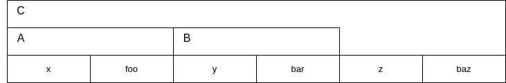

# Седмица 15 - Множествено наследяване

## Същност на множественото наследяване
Множественото наследяване е точно това, което на пръв поглед изглежда - възможност за наследяване на няколко класа едновременно. Това означава, че класа дете наследява всички член-данни и методи и на двата базови класа. За да наследим няколко класа, използваме същия синтаксис, като при наследяването на 1 клас, с разликата, че трябва да ги изброим, разделени със запетая. Да разгледаме следния пример:

```c++
class A {
public:
  A(int x) : x(x) {}

  void foo() const {
    std::cout << "foo\n";
  }

private:
  int x;
};

class B {
public:
  B(int y) : y(y) {}

  void bar() const {
    std::cout << "bar\n";
  }

private:
  int y;
};

class C : public A, public B {
public:
  C(int x, int y, int z) : A(x), B(y), z(z) {}

  void baz() const {
    std::cout << "baz\n";
  }

private:
  int z;
};
```

Не трябва да забравяме да извикаме конструкторите на всички базови класове по същия начин както го правихме и при наследяването на 1 клас. Всичко останало иначе е абсолютно същото, както и при наследяването, което разглеждахме до сега. Ако си представим как са разположени методите и член-данните на класа C в паметта, то ще бъде нещо такова:



Веднага изниква въпроса, какво се случва, ако в А и B има 2 метода с еднакво име? В този случай няма да получим грешка, ако се опитаме да наследим и двата класа, но няма да можем да извикваме този метод през обект от тип C. Това, което ще можем да правим, е в методите на C да извикваме метода от правилния родител, като укажем неговата област с оператора `::`. Това е един от многото проблеми на множественото наследяване, но е далеч не най-страшния.

## Диамантения проблем при множественото наследяване
Да предположим, че имаме следната йерархия от класове:

```c++
class A {
public:
  A(const std::string& name) : name(name) {}

  void foo() const {
    std::cout << "foo\n";
  }

private: 
  std::string name;
};

class B : public A {
public:
  B(const std::string& name, int x) : A(name), x(x) {}

  void bar() const {
    std::cout << "bar\n";
  }

private:
  int x;
};

class C : public A {
public:
  C(const std::string& name, int y) : A(name), y(y) {}

  void baz() const {
    std::cout << "baz\n";
  }

private:
  int y;
};

class D : public B, public C {
public:
  D(const std::string& name, int x, int y, int z) : B(name, x), C(name, y), z(z) {}

  void qux() const {
    std::cout << "qux\n";
  }

private: 
  int z;
};
```

Графически, тази йерархия изглежда така:


Този код се компилира без проблем, но забелязваме нещо странно - при извикването на конструктора на D се налага да подадем `name` както на конструктора на B, така и на конструктора на C. Това, което ни се иска на нас, е да има някакъв начин да подадем `name` само на 1 място, а да не се налага да повтаряме този код няколко пъти. Това обаче не е единствения проблем. Да разгледаме следния случай на употреба на D:

```c++
int main() {
  D d("name", 1, 2, 3);
  d.bar(); // bar
  d.baz(); // baz
  d.qux(); // qux
  d.foo(); // compilation error

  return 0;
}
```

При извикване на първите 3 метода няма проблем, но при извикването на `foo` получаваме компилационна грешка. За да разберем защо точно се получава така, нека отново да разгледаме как са разположени методите и член данните на D в паметта:


От тази схема виждаме, че методите и член-данните на А присъстват 2 пъти в компонентите на D - един път заради B и един път заради C. Този проблем е известен с името диамантен проблем (`Deadly diamond of death`) Това, което ни се иска е да можем да елиминираме тези повторения, за да може програмата да се компилира успешно и да работим с D, както с всеки друг клас. За съжаление няма как да "изкараме" компонентите на А от тези на B и C и да ги сложим отделно в тези на D или поне не можем да го направим директно. Това, което можем да направим, е направим А "споделен" базов клас за B и за C. За да е възможно това, трябва да укажем, че B и C наследяват виртуално А, като използваме ключовата дума `virtual` при наследяването по следния начин:

```c++
// code...

class B : virtual public A {
// more code...
```

Обърнете внимание, че в този случай употребата на `virtual` няма нищо общо с употребата ѝ при указването на виртуални методи.
Ако след тази промяна разгледаме отново представянето в паметта на D, то ще изглежда така:


Можем да си мислим, че в B и C има "указатели", които сочат към една единствена базова инстанция на А. Страничен ефект от направените промени е, че йерархията на класовете вече изглежда така:


По този начин решихме проблема с повторението на компонентите на А, но и създадохме нов проблем. В момента не е ясно кой клас трябва да извика конструктора на А. Отговорът е, че това става отговорност на D, т.е. D вече трябва изрично да извиква конструктора на А при създаването си, въпреки, че изглежда, че B и C вършат тази работа. Всъщност извикването на конструктора на А през B и C в случая се игнорира и на практика можем да подадем каквото си искаме за параметъра `name` на B и C. Това задължение се предава и надолу в йерархията, т.е. ако имаме клас Е, който наследява D, той също трябва изрично да извика конструктора на А при създаването си. Финалният коректен начин, по който трябва да изградим тази йерархия е следния:

```c++
class A {
public:
  A(const std::string& name) : name(name) {}

  void foo() const {
    std::cout << "foo\n";
  }

private: 
  std::string name;
};

class B : virtual public A {
public:
  B(const std::string& name, int x) : A(name), x(x) {}

  void bar() const {
    std::cout << "bar\n";
  }

private:
  int x;
};

class C : virtual public A {
public:
  C(const std::string& name, int y) : A(name), y(y) {}

  void baz() const {
    std::cout << "baz\n";
  }

private:
  int y;
};

class D : public B, public C {
public:
  D(const std::string& name, int x, int y, int z) : A(name), B(name, x), C(name, y), z(z) {}

  void qux() const {
    std::cout << "qux\n";
  }

private: 
  int z;
};
```

## Алтернативи на множественото наследяване
Погледнато по общо, множественото наследяване ни дава 2 основни предимства: преизползването на логика от няколко класа и възможност за полиморфизъм спрямо няколко базови класа. Второто е доста конкретно и на практика се случва изключително рядко да имаме такова изискване, докато първото е доста по-често срещан проблем. За неговото решение обаче има доста различни подходи. Сега ще разгледаме още 2 начина, по които можем да преизползваме логика от няколко класа наведнъж:
- композиция - вместо да наследяваме 2 базови класа, можем да си създадем 2 член-данни от типовете на тези класове. Това е доста по-просто решение на проблема като не усложнява допълнително йерархията и не създава нови проблеми, както множественото наследяване. Това, което губим в случая, е свойсвото на полиморфизъм и възможността за достъп до `protected` компонентите на класовете;
- шаблонът мост (`bridge design pattern`) - при него наследяваме само 1 клас, а за останалите създаваме член-данни в класа, подобно на композицията. По този начин отново запазваме простотата на йерархия, като в допълнение запазваме и полиморфизма спрямо един от класовете (както казахме, рядко ще ни се наложи да имаме полиморфизъм спрямо повече от 1 клас);
- вложени йерархии (`nested generalization`) - избираме йерархията на един клас за основна и следваме само нея. За да наследим няколко класа наведнъж, първо създаваме подклас на основния и след това създаваме толкова на брой подкласове на току що създадения подклас, колкото класове искаме да наследим. Това изглежда като по-дълъг вариант на множественото наследяване, но по този начин имаме по-голям контрол над комбинациите от наследените класове и избягваме изцяло диамантения проблем.

Няма универсален отговор на въпроса кой от горните варианти да ползваме - зависи от ситуацията. Ако все пак ни се наложи да правим избор, то може да следваме тези правила:
- ако нямаме нужда от полиморфизъм, използваме композиция;
- ако имаме нужда от полиморфизъм, но само за един от класовете, използваме `bridge`;
- ако имаме нужда от полиморфизъм, но само за един от класовете и искаме да имаме по-голям контрол над комбинациите от наследени класове (ако примерно искаме да забраним някакви комбинации), използваме `nested generalization`;
- ако имаме нужда от полиморфизъм за няколко от класовете ИЛИ искаме да наследим няколко ИНТЕРФЕЙСА, използваме множествено наследяване.

В последната точка силно наблягаме на интерфейси, понеже при тях няма как да използваме останалите методи и същевременно наследяването им не носи опасност от възникване на други проблеми (помислете защо?).

## `Sister delegation`
Нека отново разгледаме една диамантена йерархия:

```c++
class A {
public:
  virtual void foo() const = 0;
  virtual void bar() const = 0;
};

class B : virtual public A {
public:
  void foo() const final {
    bar();
  }
};

class C : virtual public A {
public:
  void bar() const final {
    std::cout << "bar\n";
  } 
};

class D : public B, public C {};

int main() {
  D* d = new D;
  B* b = d;
  C* c = d;

  d->foo(); // bar
  b->foo(); // bar
  c->foo(); // bar

  delete d;
  return 0;
}
```

Когато изпълним горния код, получаваме 3 пъти `bar`. Интересното е, че получаваме този резултат, при извикването на `foo` през указател на B, понеже в B никъде не сме дали имплементация на `bar` (B на практика е абстрактен клас). Ако обаче се сетим за представянето на D в паметта и си припомним как работят виртуалните таблици, ще се досетим, че въпреки, че указателят е кастнат към указател от тип B, той все още знае за реализацията на `bar` от C. Тази техника се нарича `sister delegation`, понеже два привидно несвързани класа успяват да си обменят (делегират) реализации на методи.

## Задача 01 - Пътешествия (първа задача от второ контролно по ООП на КН 2022 г.)
Да се реализира клас за пътешествие с полет със самолет (AirTravel). Класът съдържа: 
- номер на полет (flightNumber) – низ с произволна дължина от тип char*;
- времетраенето на полета (duration) – задава се в минути.

Да се реализира клас за пътешествие с кола (CarTravel). Класът съдържа:
- регистрационен номер на превозно средство (regNumb) – представлява масив от четири цифри;
- брой километри, които ще бъдат изминати (distance);
- времетраене на пътуването с кола (също с име duration) – задава се в минути.

Да се реализира клас за комбинирано пътешествие (CombinedTrip), при което има точно едно пътуване с кола и едно пътуване със самолет. Класът притежава всички характеристики на описаните по-горе класове и две допълнителни полета:
- списък от забележителности, които ще бъдат посетени по време на пътуването (destinations) – представя се чрез динамичен масив от низове от тип char* с произволна дължина;
- свободно време за почивка между пътуванията (freeTime) – задава се в минути.

Да се реализира метод `getDuration`, който връща общото време за пътешествието, което включва времето за пътуване с кола, това за пътуване със самолет и свободното време. Да се реализира метод `print`, който извежда цялата информацията за пътешествието на екрана.

## Задача 02 - Ястия (първа задача от писмен изпит по ООП на КН 2019 г.)
Да се напише програма, която позволява създаване и работа с множество от ястия. За целта да се създаде клас ястие (Dish). Всяко ястие (Dish) се характеризира със:
- Списък от продукти (ingredientsNames) - всеки продукт се задава чрез неговото име с произволна дължина. Списъкът съдържа максимум 100 продукта;
- Време за приготвяне (cookTime) - измерва се в минути. Да се реализира функция print, която извежда информацията за едно ястие на екрана.

За целта на нашата задача различаваме два основни типа ястия:
- Ястие с месо (MeatDish) - съдържа допълнителна член-данна месо (meat), която съдържа името на основния протеин в ястието. Член-данната meat може да приема една от следните стойности: “chicken”, “beef”, “pork”, “duck”. Да се реализира функция print, която извежда собствените и наследените данни за ястието;
- Ястие с морска храна (SeafoodDish) - съдържа допълнителна член-данна морска храна (seafood), която съдържа името на основния протеин в ястието. Член-данната seafood може да бъде име на риба или друг морски дар с произволна дължина. Валидация на стойността на член-данната не е необходима. Да се реализира функция print, която извежда собствените и наследените данни за ястието.

Да се реализира клас SurfAndTurf, представляващ ястие, което комбинира морски дарове и месо. Да се напише функция print, която извежда цялата информация за ястието. Да се реализира главна функция (main), която:
- Създава обект от тип SurfAndTurf,
- Създава указател към Dish и го свързва с динамично създаден обект MeatDish.
(Използвайте оператор new)
- Освобождава заделената памет, където е нужно.

## Задача 03 - HTML
Да се реализират следните класове, които представляват йерархия от HTML елементи:
- `BlockElement` - HTML елемент, който има зададен в CSS свойството `display: block`. Класът се характеризира с широчина, височина и дебелина на ръба (всички са в пиксели). Да се реализира метод `area`, който връща колко пиксела от екрана общо заема елемента (да се брои и мястото заето от ръба). 
- `FormElement` - наследник на `BlockElement`, който представлява HTML елемент, който е част от `form` елемент. Освен наследените характеристики, класът да има и име, представляващо `name` атрибута.
- `Label` - наследник на `FormElement`, който представлява `label` елемент. Освен наследените характеристики, класът да има и `title` - член-данна от тип std::string, която представлява текста, който стои в елемента.
- `Interactable` - наследник на `BlockElement`, който представлява HTML елемент, с който потребителят може да взаимодейства. Класът да има метод `interact`, който извършва конкретно действие при взаимодействие на потребител с елемента. Методът да бъде чисто виртуален.
- `Input` - наследник на `FormElement` и `Interactable`, който представлява `input` елемент. Освен наследените характеристики, класът да има и `value` - член-данна от тип std::string, която представлява стойността на елемента. Методът `interact` да подканва потребителя да въведе стойност и след това я запазва. Да се реализира селектор, който връща стойността в елемента.
- `Form` - `form` елемент. Класът да съдържa списък от елементи, които са част от формата. Да се реализира метод `data`, който връща вектор от стойностите на всички `Input` елементи във формата.
- `SubmitButton` - наследник на `FormElement` и `Interactable`, който представлява `button` елемент с атрибут `type="submit"`. Освен наследените характеристики, класът да има и член-данна от тип `Form`, която представлява формата, за която е закачен бутонът. Методът `interact` да "изпраща" стойностите на `Input` елементите от формата на потребителя (под "изпраща" ще разбираме извежда на екрана).

За всеки от горните класове да се реализира метод `print`, който извежда подробна информация за техните характеристиките.